# shiftware-mobile-app
NetConstructs Shiftware Mobile App PoC in progress

### This is a React Native app.  Is is currently incomplete and a work-in-progress, with the end result to be a minimum viable product (MVP).

There are no guarantees it will compile and work at any particular commit.

There are some hacks currently in the code for testing purposes, for example: a hard-coded login.  You can remove this code in the main `App` function's `useEffect()` to look at the onboarding process and the login screen.

### Onboarding

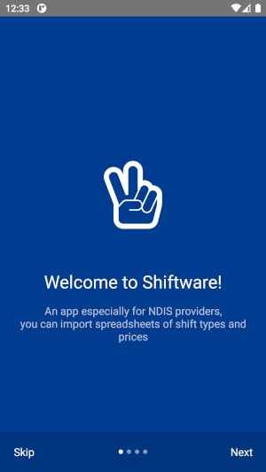
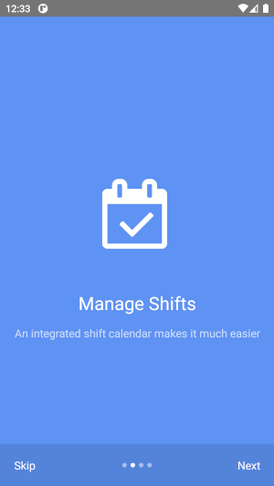
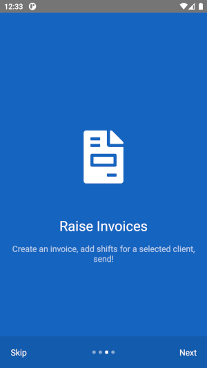


### Screenshots (WIP)

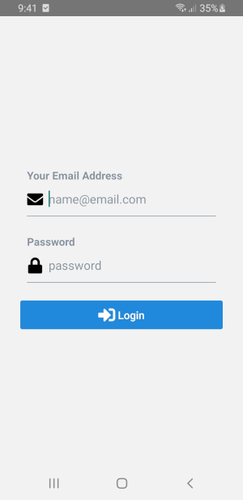
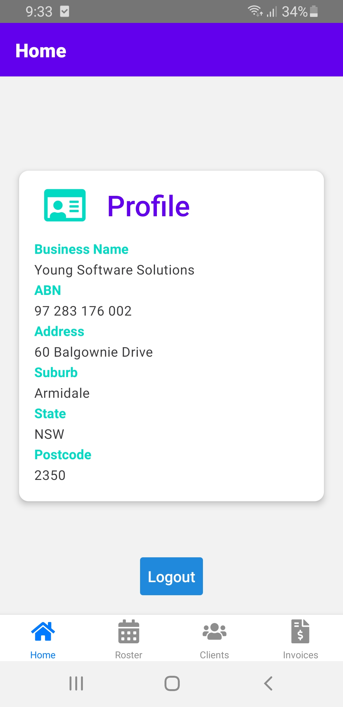
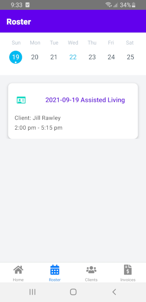
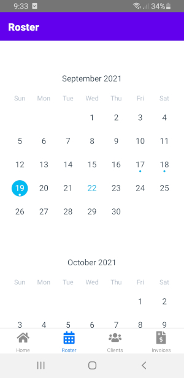
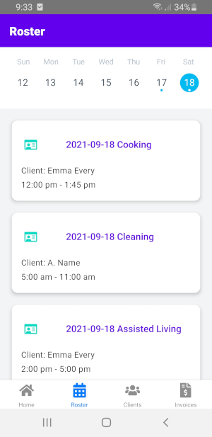
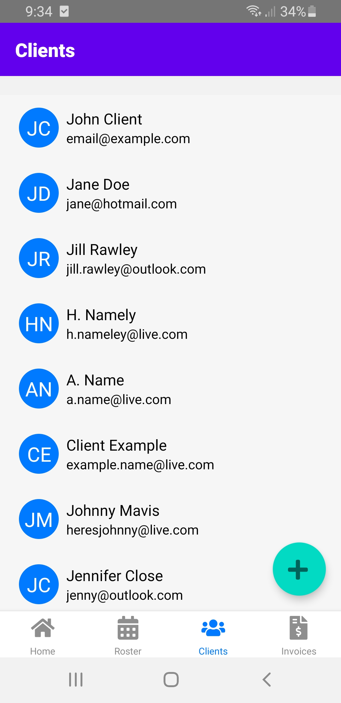
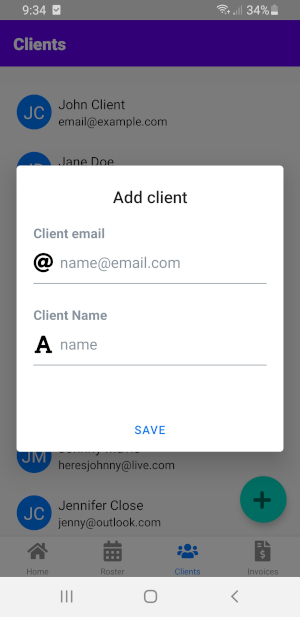
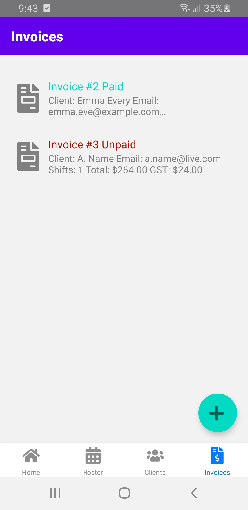


### Setup

Follow the development environment setup recommended on the React Native website.

You may have to adjust the Android SDK and NDK versions to suit your environment, or just download and install the ones I am using. You can find these in the `android/build.gradle` file.

### Build project and run on Android device or emulator

```
$ yarn install | npm install
$ yarn start | npm start
```

In another terminal:

```
$ yarn android | npm android
```

### iOS / iPhone

This may run on iOS/iPhone.  I don't have a Mac to compile and test with, so if you do and you'd like to give it a try, please let me know how it goes!
